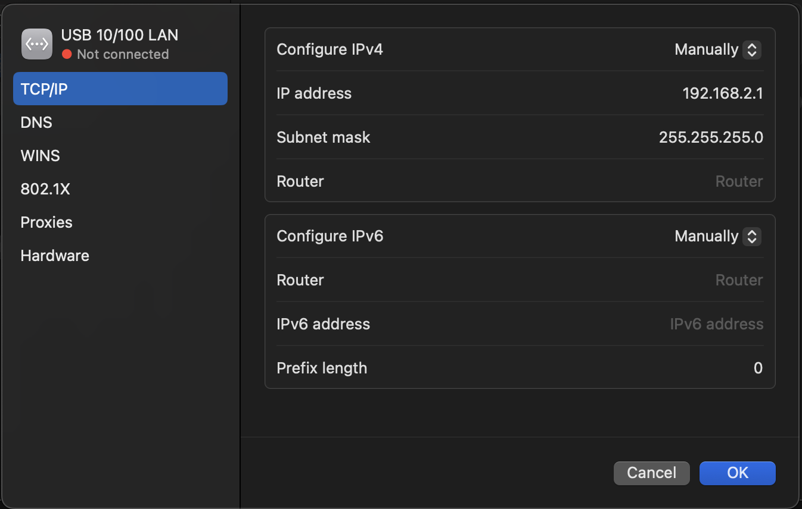

## WIFI
To get wifi working go with
`sudo apt-get upgrade linux-generic-hwe-20.04`

[More](https://askubuntu.com/questions/1398392/ubuntu-20-04-lts-driver-intel-wi-fi-6e-ax211-160mhz)


## Setup Static IP for ethernet
Paste:

```
network:
  version: 2
  renderer: networkd
  ethernets:
    enp1s0:
      dhcp4: no
      addresses:
        - 192.168.2.4/24
      gateway4: 192.168.2.1
      nameservers:
        addresses:
          - 8.8.8.8
          - 1.1.1.1
  wifis:
    wlo1:
      dhcp4: true
      access-points:
        "<ROUTER SSID>":
          password: <password>
      optional: true
```
inside `/etc/netplan/00-installer-config.yaml` or `/etc/netplan/01-netcfg.yaml`


On connecting device for example Mac ethernet should be configured as gateway above



