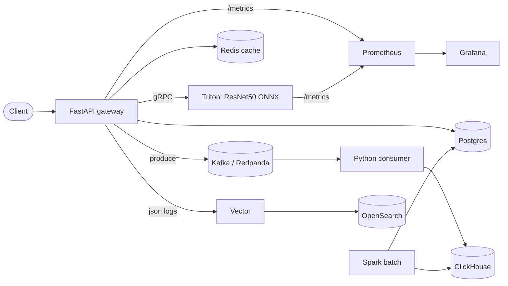

# little_ml_story

A compact, opinionated MLOps lab built around a FastAPI gateway and Triton Inference Server. Every tool listed in the JD has at least one runnable touchpoint, so you can ramp up by **doing** rather than reading.

> Preparation project for Middle Python / MLOps Engineer role.
> Required stack: Python/FastAPI, PostgreSQL, ClickHouse, Kafka, Redis, Spark, Prometheus, Grafana, OpenSearch/ELK, Triton Inference Server.

## What it does

A client uploads an image. The FastAPI gateway:

1. Hashes the bytes and checks Redis for a cached prediction.
2. On miss, preprocesses the image and calls a **ResNet50 ONNX** model in **Triton** over gRPC.
3. Persists the request metadata to **Postgres**.
4. Caches the response in **Redis**.
5. Emits a JSON event to **Kafka** (Redpanda).
6. A small Python consumer drains the topic into **ClickHouse** for analytics.
7. **Prometheus** scrapes API + Triton + exporters; **Grafana** renders dashboards.
8. **Vector** ships container logs to **OpenSearch** for log search.
9. A nightly **Spark** batch rolls ClickHouse events into a Postgres `daily_class_counts` table.

## Architecture



## Quick start

Prerequisites: Docker Desktop (or Colima), `make`, `curl`, `jq`. For the k8s leg: `kind`, `kubectl`, `helm`. For load testing: `k6`.

```bash
make env              # copy .env.example to .env
make fetch-model      # download ResNet50 ONNX into infra/triton/model_repository
make up-all           # boot core + observability stacks
make migrate          # apply alembic schema
make predict IMG=tests/fixtures/cat.jpg
```

Then open:

| What | URL |
| --- | --- |
| FastAPI docs | http://localhost:8000/docs |
| Triton HTTP | http://localhost:8000-triton (mapped to 8800) |
| Grafana | http://localhost:3000 (admin / admin) |
| Prometheus | http://localhost:9090 |
| OpenSearch Dashboards | http://localhost:5601 |
| ClickHouse Play | http://localhost:8123/play |
| Redpanda Console | http://localhost:8080 |

## Repository layout

```
.
├── apps/
│   ├── api/                 # FastAPI gateway
│   ├── consumer/            # Kafka -> ClickHouse sink
│   └── spark_jobs/          # PySpark batch rollups
├── infra/
│   ├── triton/              # model_repository + fetch_model.sh
│   ├── postgres/            # init.sql
│   ├── clickhouse/          # init.sql
│   ├── prometheus/          # prometheus.yml
│   ├── grafana/             # provisioning
│   ├── opensearch/          # config
│   ├── vector/              # log shipping
│   ├── load/                # k6 script
│   └── k8s/                 # kind config + manifests + helm chart
├── tests/                   # unit + e2e
├── tasks/                   # fast-track day-by-day + advanced curriculum
├── docs/                    # talking-points + runbook
├── docker-compose.yml
├── docker-compose.observability.yml
├── Makefile
└── pyproject.toml
```

## Learning curriculum

- [tasks/fast_track_day1.md](tasks/fast_track_day1.md) — Serving spine (FastAPI + Triton + Postgres + Redis).
- [tasks/fast_track_day2.md](tasks/fast_track_day2.md) — Streaming + observability (Kafka + ClickHouse + Prometheus/Grafana + OpenSearch).
- [tasks/fast_track_day3.md](tasks/fast_track_day3.md) — Spark batch + k8s + polish.
- [tasks/advanced.md](tasks/advanced.md) — Reference exercises, one block per tool.
- [docs/talking-points.md](docs/talking-points.md) — 60-second pitch + likely follow-ups per tool.

## Out of scope

- Model training, accuracy tuning, dataset curation.
- Production auth/multi-tenancy (a stub API key lives in the advanced track).
- Production secret management — `.env` is enough for the lab.
