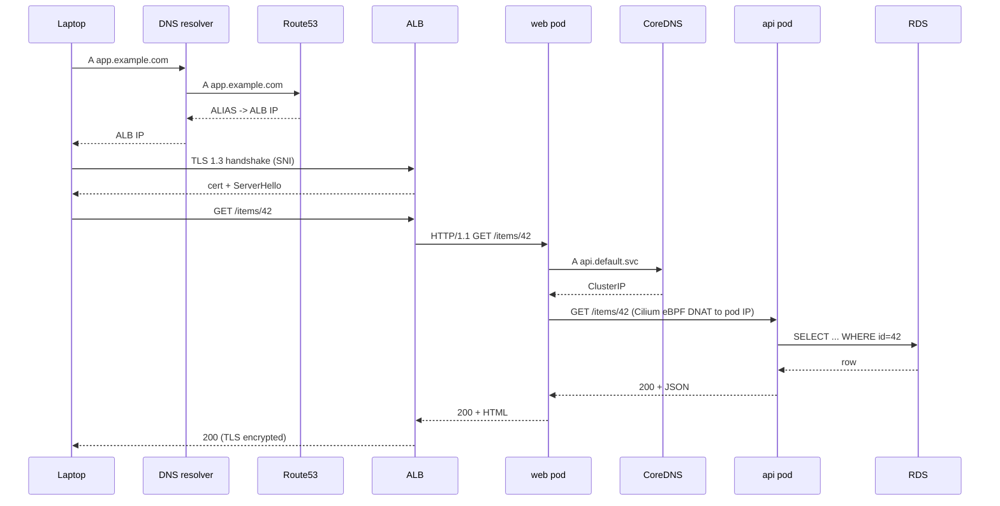

# Packet Flow: Laptop -> https://app.example.com -> RDS row

> Capstone deliverable. Fill this in during W16. Replace every `<...>` with what you actually observe in your deployment.

## Setting

- Client: my laptop, IP `<HOME_PUBLIC_IP>`, behind home NAT.
- Edge: AWS ALB at `<ALB_DNS>` (eu-central-1), TLS terminated with ACM cert for `app.example.com`.
- Cluster: EKS 1.30 in private subnets, Cilium as CNI (no kube-proxy, native AWS VPC routing).
- App: web (nginx) -> api (Go) -> RDS Postgres at `<RDS_ENDPOINT>:5432`.
- Request: `curl -v https://app.example.com/items/42`.

## Phase 1 - DNS

Trace `app.example.com` resolution from the laptop:

1. Browser/curl asks the local stub resolver.
2. Stub asks system resolver (e.g. `1.1.1.1` or your ISP's).
3. Recursive resolver walks: root -> `.com` TLD -> Route53 NS for `example.com`.
4. Route53 returns an `ALIAS` to the ALB DNS name -> resolves to one or more public IPs of the ALB ENIs.

Key outputs to capture:

```
dig +trace app.example.com
```

Record TTL, AS path of the recursive resolver, ALB IP returned.

## Phase 2 - TCP + TLS to ALB

1. Laptop opens TCP/443 to `<ALB_PUBLIC_IP>`.
2. SYN -> SYN/ACK -> ACK. (Capture with `tcpdump -i any -w client.pcap host <ALB_PUBLIC_IP>`.)
3. ClientHello with SNI=`app.example.com`. ALB selects the right ACM cert based on SNI.
4. TLS 1.3 handshake completes in 1-RTT. Cipher chosen: `<TLS_AEAD>`.
5. HTTP/2 (likely) negotiated via ALPN.

What to record:

- Cert chain returned by ALB (`openssl s_client -connect <ALB>:443 -servername app.example.com`).
- Cipher / TLS version.
- ALPN result.

## Phase 3 - ALB to Pod

ALB target group: `<TG_ARN>`, target type `<ip|instance>`.

- If `target type = ip`: ALB has registered each pod IP as a target via the AWS Load Balancer Controller. ALB ENIs talk *directly* to pod IPs (which are routable in the VPC because Cilium uses AWS VPC native routing, or because aws-vpc-cni gave each pod a real ENI IP).
- If `target type = instance`: ALB sends to a NodePort on a node ENI; kube-proxy/Cilium then NAT/translates inside the node.

Record:
- Target type chosen and why.
- One target IP (`aws elbv2 describe-target-health --target-group-arn ...`).
- The path the packet takes from the ALB ENI to the pod (subnet route, SG between ALB SG and node/pod SG).

## Phase 4 - Inside the node

When the packet hits the node's ENI:

1. **AWS layer.** Hypervisor delivers to the ENI in the host netns. Source NAT considerations? (Usually none here - we want client IP preserved by ALB through `X-Forwarded-For`.)
2. **Linux routing.** Packet enters host netns. Linux routing lookup decides interface.
3. **Cilium eBPF.** `tc ingress` on the host netns interface runs Cilium's BPF program. Identity-aware policy is checked.
4. **veth pair.** Packet hits the pod side of the veth pair, which is in the pod's network namespace.
5. **Pod.** nginx accepts the connection.

Record:
- `ip route` from the node.
- `cilium endpoint list` and the identity of the web pod.
- `cilium hubble observe --pod web/<podname> --follow` output for the request.

## Phase 5 - web pod to api pod

Inside the pod, nginx proxies to `http://api.default.svc.cluster.local/items/42`:

1. **DNS.** First call goes to CoreDNS (cluster IP `10.96.0.10` or similar). DNS returns the ClusterIP of `api`.
2. **ClusterIP.** No interface owns this IP. Cilium's BPF translates dst IP+port to a chosen pod IP from the EndpointSlice.
3. **Across nodes.** Cilium uses AWS VPC routing - the destination pod IP is a real VPC IP, AWS routes it to the correct ENI / node. No VXLAN.
4. **Conntrack.** Cilium's eBPF conntrack records the flow on both sides.
5. **NetworkPolicy.** Web's egress allow includes "to: api on TCP/8080", and api's ingress allow includes "from: web on TCP/8080". Hubble shows `verdict=FORWARDED`.

Record:
- The two pod IPs.
- Hubble flow log line.
- `cilium policy get` showing the L3/L4 policies enforced.

## Phase 6 - api pod to RDS

1. **DNS.** api resolves the RDS endpoint via CoreDNS -> upstream R53 private hosted zone (or public).
2. **TCP/5432.** api's egress NetworkPolicy allows the RDS subnet CIDR on 5432.
3. **Out of pod, out of node.** Same node->VPC path.
4. **RDS SG.** Inbound rule allows `<EKS_NODE_SG>` on 5432.
5. **Postgres connection.** TLS optional - record whether it's enforced.

Record:
- RDS SG inbound rules.
- Postgres connection string + `sslmode`.

## Phase 7 - Return path

For every hop above, write the symmetric return:

- RDS -> api: SG is stateful, no extra allow needed.
- api -> web: Cilium conntrack matches return.
- web -> ALB: kept-alive HTTP/1.1 between ALB and target. Response goes back over the established TCP connection.
- ALB -> client: established TLS connection. ALB sends the response bytes encrypted.
- Client: TCP ACK, TLS record decrypt, application receives the response.

## Summary diagram



## What broke when you tried it (and how you fixed it)

Honest log of every misstep this capstone surfaced. Future you will thank present you.

- ...
- ...
- ...
