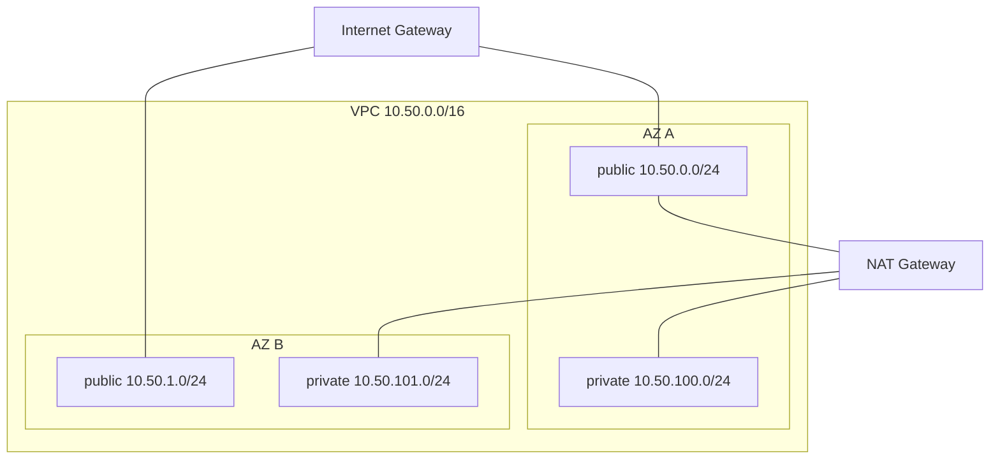

# 00-vpc - base VPC

Two AZs, two public subnets, two private subnets, IGW, single NAT GW (toggleable), VPC flow logs to CloudWatch.



## Use

```bash
cp terraform.tfvars.example terraform.tfvars
terraform init
terraform plan
terraform apply
```

Outputs feed into `01-bastion/` and `02-eks/` via `terraform_remote_state` or by passing the IDs explicitly.

## Tear down

```bash
terraform destroy
```

NAT Gateway and EIP charges stop the moment `destroy` finishes.

## What to break (W15 exercise)

- Remove the `0.0.0.0/0` -> NAT route from `aws_route_table.private` and try to `curl` from a private host.
- Detach the public subnet from `aws_route_table.public` and try to reach the IGW.
- Add a restrictive NACL rule deny:any-any and reproduce both stateless directions failing.
