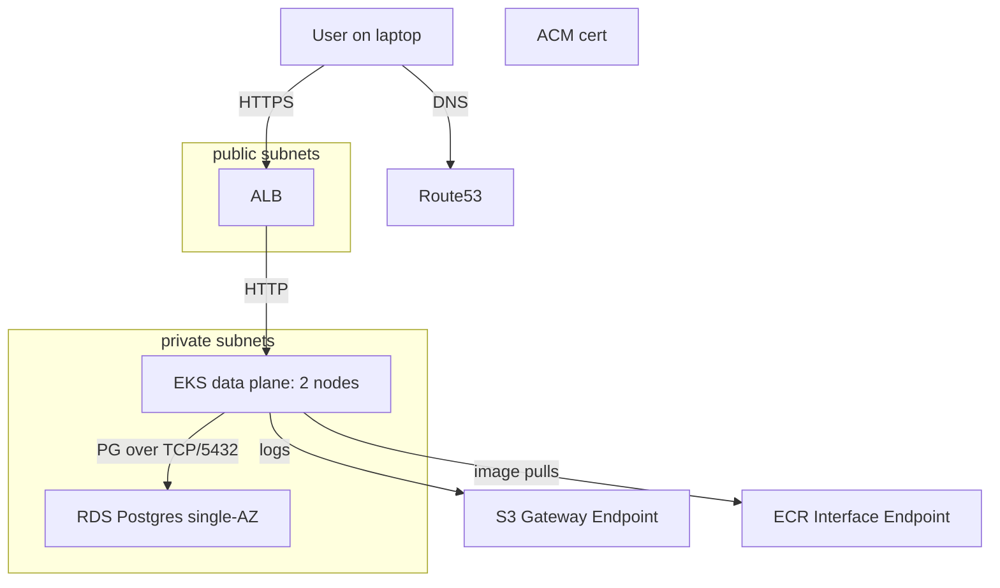

# Week 16 - Capstone: EKS in a hardened VPC + edge

The deliverable for the entire course is a single document: `capstone/PACKET_FLOW.md`. If you can write it without notes after this week, the curriculum has done its job.

## Goal

Design, deploy, and document a 3-tier app on EKS in a hardened VPC, then trace a single HTTPS request from your laptop all the way to a row in RDS, naming every header rewrite, hop, NAT, conntrack entry, SG/NACL evaluation, route-table lookup, and kube-proxy/Cilium decision along the way.

## Architecture



## Build steps

1. Make sure W15's `00-vpc` is up.
2. Build out `lab/aws/terraform/02-eks/`:
   - Use `terraform-aws-modules/eks/aws` with version 1.30+.
   - 2 t3.medium (or t4g.medium) managed nodes in private subnets.
   - Cilium as CNI (replace `aws-vpc-cni`). Replace kube-proxy.
   - ALB controller (IRSA-bound to a service account).
   - Add VPC interface endpoints: `ecr.api`, `ecr.dkr`, `sts`, `logs`. Gateway endpoint for S3.
3. Build out `lab/aws/terraform/03-edge/`:
   - ALB (public).
   - Route53 alias record.
   - ACM cert (DNS-validated).
4. Deploy a 3-tier sample app via `kubectl`:
   - Web (nginx serving static).
   - API (small Go/Python service).
   - Postgres in RDS (`aws_db_instance`, single-AZ for cost).
5. NetworkPolicy:
   - Default-deny in all relevant namespaces.
   - Allow web -> api on its port.
   - Allow api -> RDS-CIDR on 5432.
   - Allow CoreDNS access for everyone.
6. Validate end-to-end:
   ```bash
   curl -v https://app.<your-domain>/
   ```
7. Use Reachability Analyzer for SG-level verification.
8. Use Cilium Hubble to verify pod-level NetworkPolicy enforcement.

## The deliverable: `capstone/PACKET_FLOW.md`

Trace one specific HTTPS request from your laptop to a database row, broken into the following phases. For each, name the relevant addresses, ports, headers, kernel state, and AWS state.

1. **DNS.** Local resolver -> recursive -> Route53 (authoritative for your zone) -> A/AAAA record for `app.<your-domain>`.
2. **TLS.** Client connects to ALB. ClientHello (SNI = `app.<your-domain>`). ALB picks ACM cert. TLS 1.3 1-RTT handshake.
3. **ALB -> Pod.** ALB's target group entries are pod IPs (when using `IP` target type with the AWS LB controller) or instance NodePorts (when `instance` mode). Trace which.
4. **Node-level.** Packet arrives at node ENI. SG decision (stateful). ENI delivers to host netns. Linux routing lookup -> Cilium eBPF pre-routing -> pod veth.
5. **Pod -> Pod (web -> api).** DNS lookup (CoreDNS), ClusterIP resolution, Cilium service-translation (no kube-proxy). Across nodes: Cilium native routing (no overlay if `routingMode=native` and AWS native VPC routing is configured) or VXLAN.
6. **Pod -> RDS.** Pod sends to RDS endpoint hostname. CoreDNS -> R53 split-horizon? ENI for RDS in private subnet. SG on RDS allows from EKS node SG. TCP 5432.
7. **Return path.** Conntrack on each Linux hop tracks the flow. ALB stateful target group. TLS termination at ALB; backend connection is plaintext or TLS depending on config.

End with one diagram (mermaid or PlantUML) summarizing the full path.

## Tear-down

Cost discipline:

```bash
cd lab/aws/terraform/02-eks    && terraform destroy
cd lab/aws/terraform/03-edge   && terraform destroy
cd lab/aws/terraform/01-bastion && terraform destroy
cd lab/aws/terraform/00-vpc    && terraform destroy
```

Order matters - the EKS cluster must be down before VPC subnets/NAT GW are destroyed.

## What "done" looks like

- `capstone/PACKET_FLOW.md` exists and you'd be confident reading it aloud at an interview.
- All terraform `destroy` cleanly.
- Your `notes.md` reads like a postmortem of every decision: why ALB target type IP vs instance, why Cilium native routing vs overlay, why SG vs NACL, why VPC endpoints.
